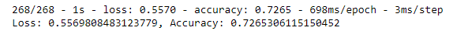
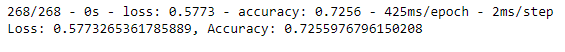
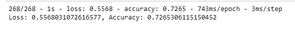
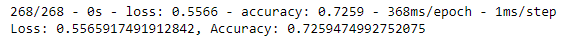

# Neural_Network_Charity_Analysis

# Overview

The objective is to utilize machine learning and neural networks to help determine which are the best charities for Alphabet Soup to invest in. The dataset contains information about for more than 34,000 charities that has been gathered over the years. The features provided will be used to create a binary classifier to help Alphabet Soup determine if applicants will successfully use their funding dollars. 

# Results: 

### Data Preprocessing: 

- The target variable is IS_SUCCESSFUL which captures if the money used effectively.

- The features of the for the model are: 

    - APPLICATION_TYPE—Alphabet Soup application type

    - AFFILIATION—Affiliated sector of industry

    - CLASSIFICATION—Government organization classification

    - USE_CASE—Use case for funding

    - ORGANIZATION—Organization type

    - STATUS—Active status

    - INCOME_AMT—Income classification

    - SPECIAL_CONSIDERATIONS—Special consideration for application

    - ASK_AMT—Funding amount requested

- The EIN and Name column can be removed from the input data since it is just a way to identify the charities and has no affect on whether the funding was successful or not

### Compiling, Training, and Evaluating the Model

- When building the neural network, two hidden layers were used. The first hidden layer used 80 neurons with a ReLU activation function and the second hidden layer used 30 neurons, also with the ReLU activation function. ReLU was used since it is the most common one to try and the number of neurons in the first hidden layer should be roughly 2-3 times the number of inputs. The number of inputs is 43 so roughly two times the number of inputs was used for the number of neurons in the first hidden layer. 

- With the above design, the model was not able to achieve the achieve the target model performance of 75%. 

- Three different optimization methods were tried: 

(1) Increasing the number of Epochs

(2) Increase bins

(3) Use tanh activation function in the hidden layers

### Summary: Summarize the overall results of the deep learning model. Include a recommendation for how a different model could solve this classification problem, and explain your recommendation.

The orignal model had an accuracy of 0.726

Increasing the epochs to 200 from 50 yielded an accuracy of 0.725. 

Increasing the number of bins yielded an accuracy of 0.726. 

Using a tanh activation function rather than a ReLU activation function in the hidden layers yielded an accuracy of 0.725. 

None of the optimized models changed the accuracy of the model. In this instance, a neural network may not be the best method for classification. A supervised machine learning model, such as Logistic Regression or a Decision Tree or Random Forest Classifier, might be a better fit. Logistic Regression and Random Forest have a higher interpretability than a neural network model. This model may be used and interpreted by more than just the data scientists within Alphabet Soup. It is recommended to try a Random Forest classifier next since it has they it is a robust and scalable model, and can handle outliers and nonlinear data. Determing the sufficient number of estimators and tree depth might produce a model that outperforms the neural network model built here. 